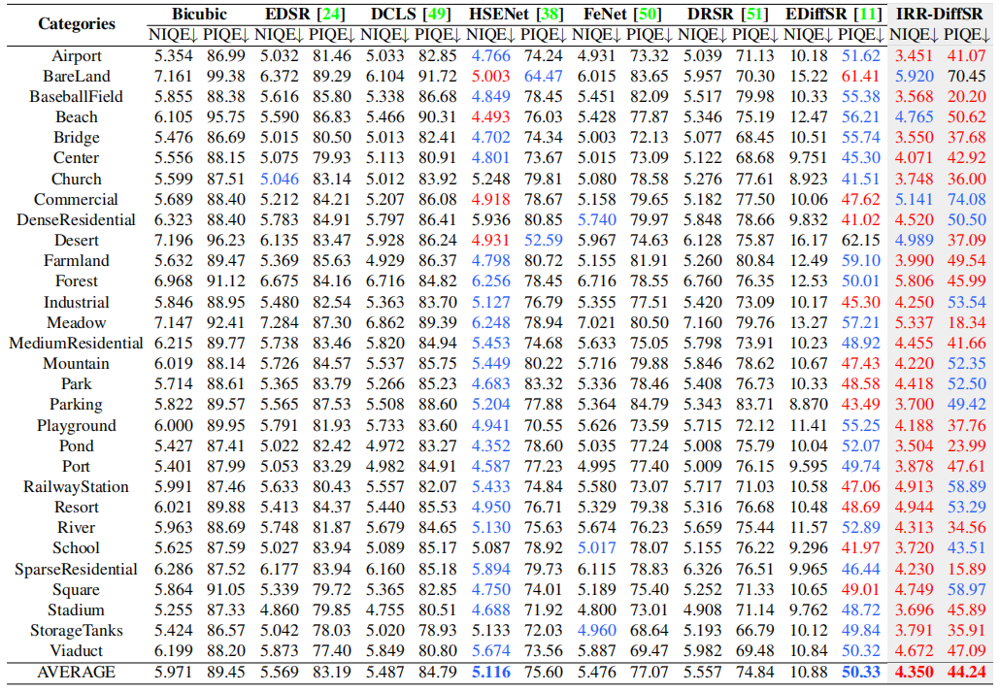
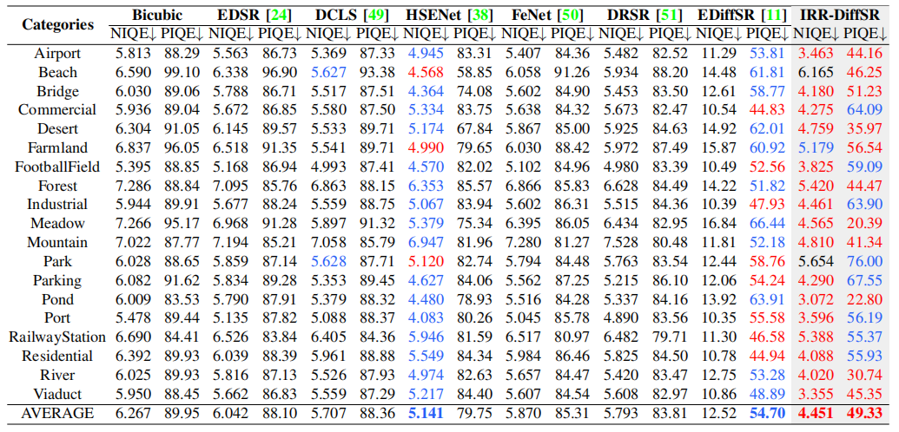
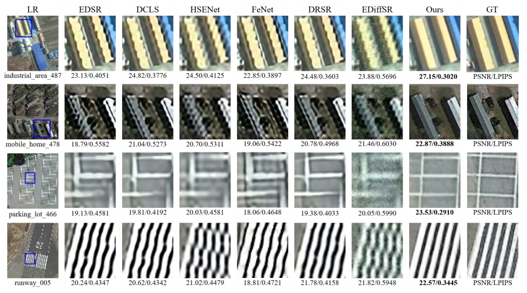
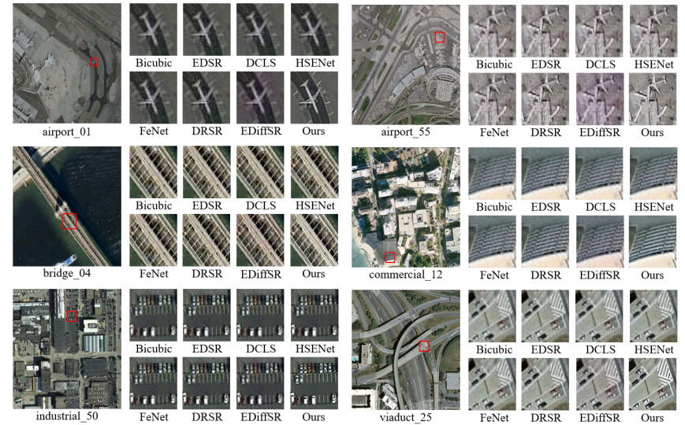

# IRR-DiffSR
This is an official implementation of the 'Efficient High-Frequency Texture Recovery Diffusion Model for Remote Sensing Image Super-Resolution'.

## Installation
```
sudo apt-get update
sudo apt install tmux
sudo apt install libgl1-mesa-glx
pip3 install basicsr --index-url http://pypi.douban.com/simple --trusted-host pypi.douban.com
pip3 install -r requirements.txt --index-url http://pypi.douban.com/simple --trusted-host pypi.douban.com
pip3 install pandas --index-url http://pypi.douban.com/simple --trusted-host pypi.douban.com
sudo python3 setup.py develop
#sudo pip uninstall bytedmetrics
pip3 install einops --index-url http://pypi.douban.com/simple --trusted-host pypi.douban.com
pip3 install lpips --index-url http://pypi.douban.com/simple --trusted-host pypi.douban.com

pip3 install torchsummary --index-url http://pypi.douban.com/simple --trusted-host pypi.douban.com
```

## Start up
To get a quick start:

### Train
```
# Train Stage 1: pretrain IRR-Encoder
CUDA_VISIBLE_DEVICES=0 python3 IRR_DiffSR/train.py -opt options/train_IRR_DiffSR_S1_x4.yml
# Train Stage 2: train IRR_DiffSR
CUDA_VISIBLE_DEVICES=1 python3 IRR_DiffSR/train.py -opt options/train_IRR_DiffSR_S2_x4.yml
```

### Test
```bash
CUDA_VISIBLE_DEVICES=2 python3  IRR_DiffSR/test.py -opt options/test_IRR_DiffSR_S2_x4.yml 
#You should change the corresponding model weights and dataset paths to your corresponding paths.
```


## Results

###  Quantitative comparisons on the AID dataset with upscale ×4.



### Quantitative comparisons on the WHU-RS19 dataset with upscale ×4.



### Some visual comparisons.

#### **Quality Result-1:**



**Quality Result-2:**




## Contact
Should you have any question, please contact 55dupup@gmail.com
